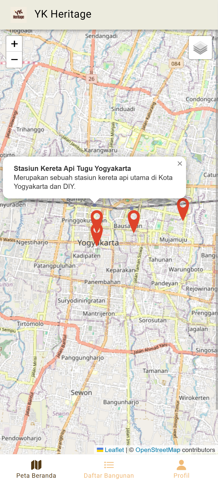
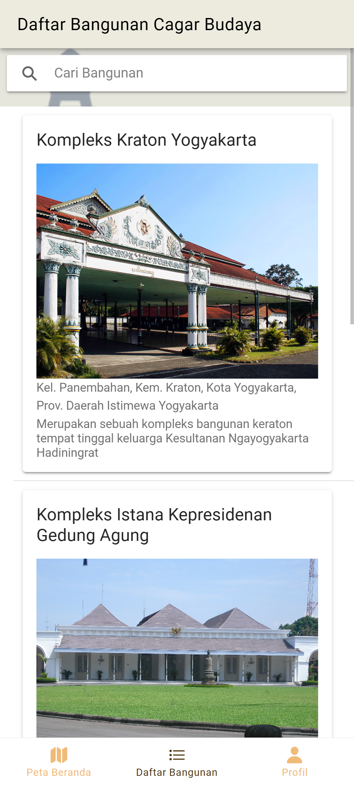
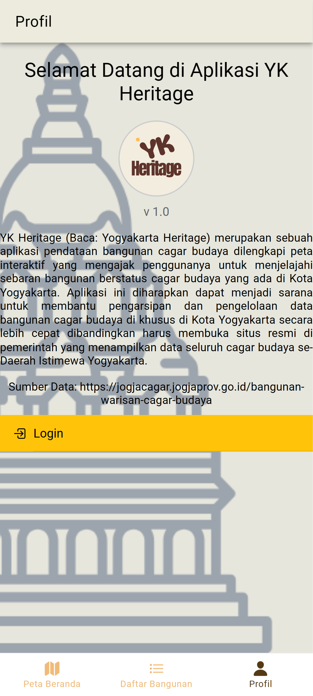

## YK Heritage 
Aplikasi sederhana hybrid 

**YK Heritage** *(Baca:  **Y**ogya**k**arta Heritage)* merupakan sebuah aplikasi pendataan bangunan cagar budaya dilengkapi peta interaktif yang mengajak penggunanya untuk menjelajahi sebaran bangunan berstatus cagar budaya yang ada di Kota Yogyakarta. Aplikasi ini diharapkan dapat menjadi sarana untuk membantu pengarsipan dan pengelolaan data bangunan cagar budaya di khusus di Kota Yogyakarta secara lebih cepat dibandingkan harus membuka situs resmi di pemerintah yang menampilkan data seluruh cagar budaya se-Daerah Istimewa Yogyakarta.

**Komponen Pembangun Aplikasi Hybrid :**
* **Ionic** sebagai *framework* atau komponen utama dalam penyimpanan serangkaian kode WebGIS
* HTML sebagai bahasa pemrograman penampil utama dalam aplikasi
* **Leaflet.js** peta dasar penyusun peta interaktif
* **Vercel** komponen web hosting untuk publikasi secara luas 

**Sumber Data :**
* https://jogjacagar.jogjaprov.go.id/bangunan-warisan-cagar-budaya

**Tangkapan Layar :** 
* Halaman Awal dengan Peta Interaktif

* Daftar Bangunan Cagar Budaya

* Informasi Aplikasi

